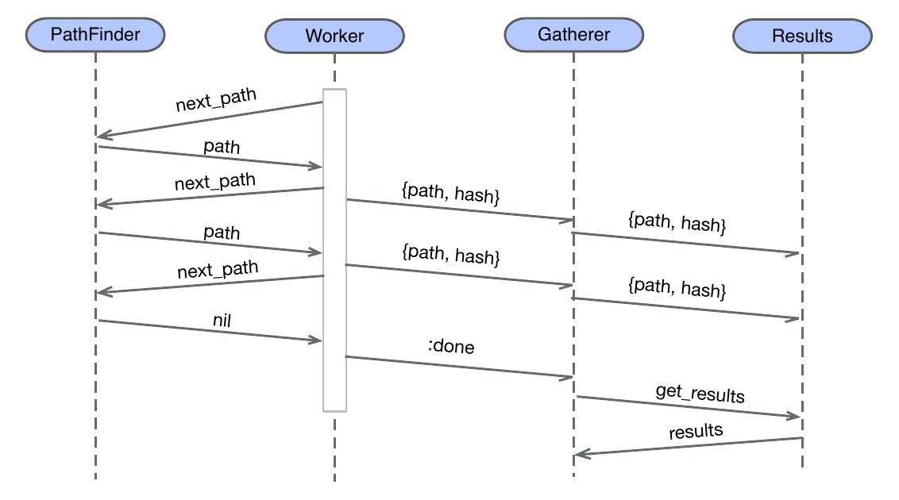
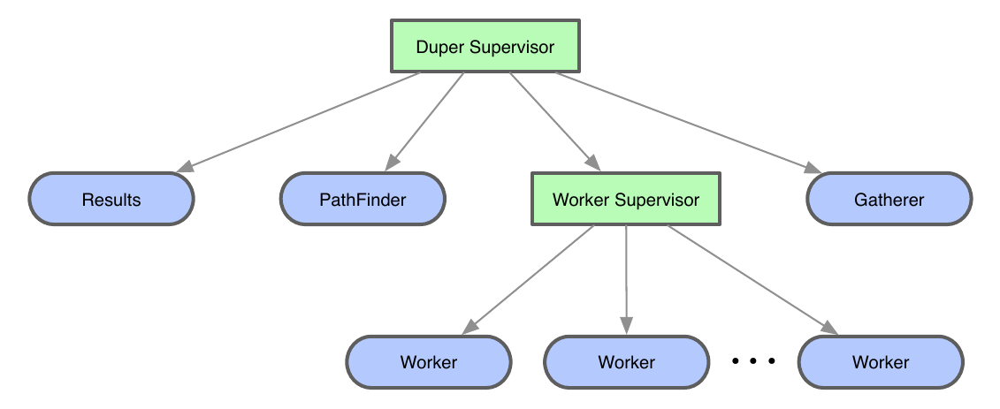

# Duper

Esse projeto foi feito com base no projeto do capitulo 19 do livro [Programming Elixir 1.6 - Functional |> Concurrent |> Pragmatic |> Fun](https://www.amazon.com.br/Programming-Elixir-1-6-Dave-Thomas/dp/1680502999), que tem como objetivo criar uma aplicação que irá listar todos os arquivos duplicados de um diretório.


Fonte: Imagem retirada do livro citado.


Fonte: Imagem retirada do livro citado.

## Como Executar o Projeto

Clone o projeto, entre no diretório e então execute:

```shell
➜ mix run --no-halt
Results:

["./.elixir_ls/build/_test/lib/duper/.mix/compile.lock",
 "./.elixir_ls/build/_test/lib/dir_walker/.mix/compile.fetch",
 "./deps/dir_walker/.fetch", "./_build/dev/lib/duper/.mix/compile.lock",
 "./_build/dev/lib/dir_walker/.mix/compile.fetch"]
["./.elixir_ls/build/_test/lib/dir_walker/.mix/compile.elixir_scm",
 "./_build/dev/lib/dir_walker/.mix/compile.elixir_scm"]
...
```
